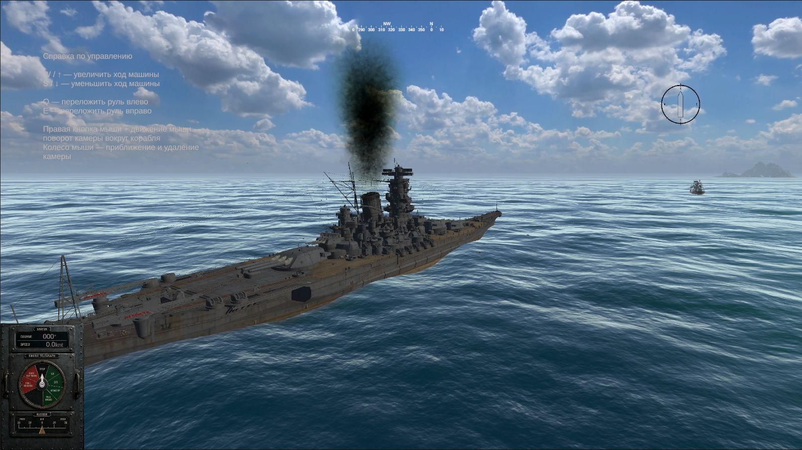

# BattleShip

BattleShip is a Unity 6 naval artillery combat prototype centered on heavy ships, inertia, maneuvering, and deliberate command decisions. The project is moving toward large-scale ship combat in the spirit of World of Warships, but with a stronger focus on ship mass, crew management, and tactical control over the battle.

## What The Game Is About

The player takes the role of a commander of a large warship and fights artillery duels where positioning, range, firing timing, and ship handling all matter. The core fantasy is not instant arcade reaction, but giving an order to a heavy machine and watching it gradually carry that order out.

At the center of the experience are:

- engine telegraph-based speed control;
- rudder control with visible inertia;
- turret traversal and main battery gunnery;
- shell ballistics and dispersion;
- crew as a limited ship resource;
- survivability decisions under fire.

## Current MVP Focus

The current gameplay target is a **1 vs 1 duel** on open water between the player ship and a basic AI opponent.

This MVP is built around a short but complete combat loop:

1. Assess the position of your ship and the enemy.
2. Set speed through the engine telegraph.
3. Adjust course through the rudder.
4. Keep the target inside firing arcs.
5. Fire salvos with reload, distance, and dispersion in mind.
6. Trade damage until one ship is destroyed.

### Included In The MVP

- Heavy ship movement with acceleration, deceleration, and turning inertia.
- Telegraph-driven propulsion states: reverse, stop, and several forward speed steps.
- Rudder control with gradual response instead of instant turning.
- Main battery aiming and turret rotation toward a selected target.
- Basic shell ballistics, dispersion, and hit-based damage.
- Combat HUD with key ship and firing information.
- A basic AI opponent for duel validation.
- Crew as an important resource for combat efficiency and survivability.

### Intentionally Deferred

- Campaign and global map layer.
- Control of multiple player ships.
- Advanced compartment damage simulation.
- Torpedoes, aviation, and layered AA combat.
- Multiplayer modes.
- Expanded visibility scenarios such as night battles.

## Core Design Pillars

### Weight And Inertia

Ships should feel large and heavy. Speed changes, rudder shifts, and tactical repositioning all take time and commitment.

### Gunnery Over Twitch Action

Combat is built around firing angles, distance management, reload windows, and reading shell fall rather than constant twitch aiming.

### Crew As A Strategic Resource

A ship is defined not only by guns and armor, but by how effectively the player distributes people between combat posts, control, observation, and damage control.

### Readable Tactical Feedback

The player should always understand the state of propulsion, rudder, guns, target, and ship survivability through clear visual feedback.

## Current Project Status

The project already has a solid foundation for prototyping naval combat: ship movement, propulsion and maneuvering systems, rudder control, turrets, projectiles, and battle-facing UI. The next major step is to tighten these systems into a stable and repeatable duel loop: movement, target selection, artillery exchange, damage resolution, and a victory or defeat outcome.

## Technology

- **Engine:** Unity 6
- **Genre:** 3D naval combat prototype
- **Technical approach:** gameplay-tunable kinematic systems instead of a full rigidbody-based naval simulation
